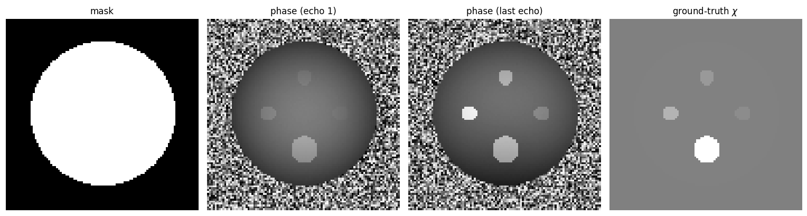
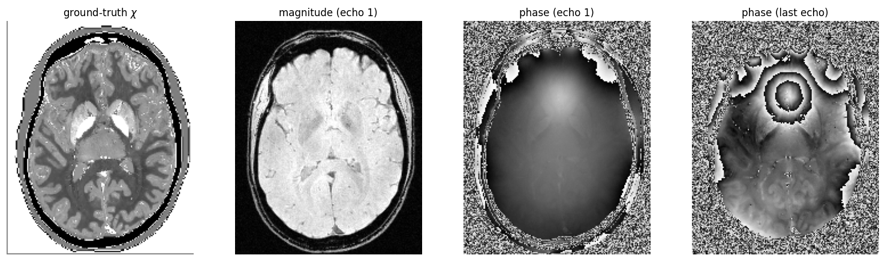
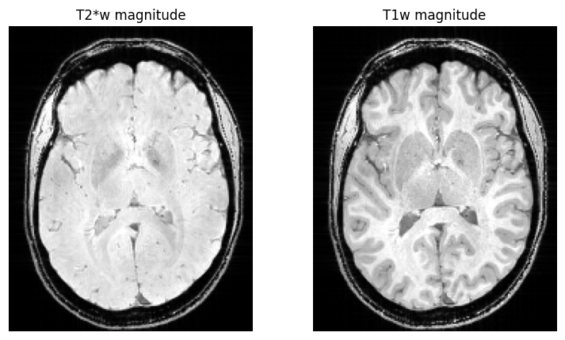
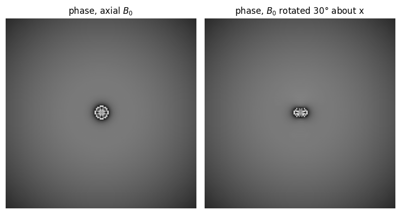
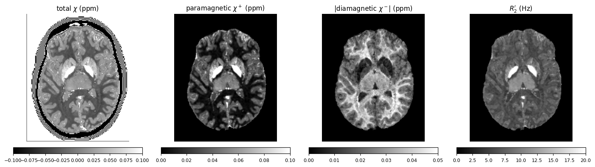
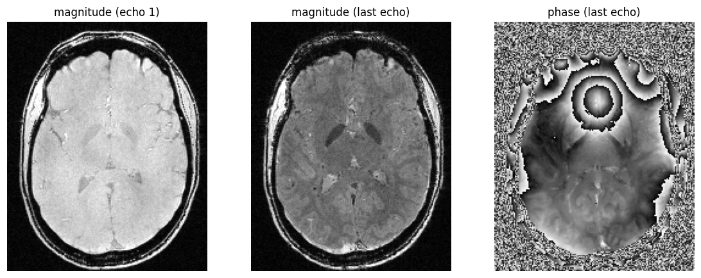

# QSM Forward Model

This package provides a Python API and CLI for simulating input data for Quantitative Susceptibility Mapping (QSM), including BIDS-compliant magnitude and phase MRI. This is also known as the QSM *forward problem* or *forward model*. A good quality forward model is important for testing and evaluating QSM algorithms under controlled conditions and in developing deep-learning models for QSM.

Based on Marques, J. P., et al. (2021). QSM reconstruction challenge 2.0: A realistic in silico head phantom for MRI data simulation and evaluation of susceptibility mapping procedures. Magnetic Resonance in Medicine, 86(1), 526-542. https://doi.org/10.1002/mrm.28716

The optional chi-separation model (paramagnetic/diamagnetic susceptibility splitting, per-tissue χ⁺/χ⁻ reference values, white-matter anisotropy, and the chi-sep-aware GRE signal, T2/R2, Dr, R2′ and 3T-scaling maps) is a Python port of the [Susceptibility-Separation-Phantom](https://github.com/neuropoly/Susceptibility-Separation-Phantom) (MIT, © NeuroPoly 2024). Per-tissue χ⁺/χ⁻ and white-matter anisotropy values are taken from that phantom's `data/chimodel/SusceptibilityValues.mat` and README Tables 1–2. If you use these features, please also cite Ridani, S., De Leener, B., & Alonso-Ortiz, E. (2026). A realistic in-silico brain phantom for quantifying susceptibility anisotropy-induced error in susceptibility separation. bioRxiv. https://doi.org/10.64898/2026.04.07.716972. See the [`NOTICE`](NOTICE) file for full attribution.

Includes code for:

 - Field model (forward multiplication with dipole kernel based on chi)
 - Signal model (magnitude and phase simulation based on field/M0/R1/R2star)
 - Phase offset model
 - Noise model
 - Shim field model
 - k-space cropping
 - Chi-separation model (paramagnetic χ⁺ / diamagnetic χ⁻ splitting, R2/R2′/Dr maps, chi-sep-aware GRE signal, and white-matter anisotropy)

## Install

```
pip install qsm-forward
```

## Example using simulated sources

In this example, we simulated susceptibility sources (spheres and rectangles) to generate a BIDS directory:

```python
import qsm_forward

if __name__ == "__main__":
    recon_params = qsm_forward.ReconParams()
    recon_params.subject = "simulated-sources"
    recon_params.peak_snr = 100
    recon_params.random_seed = 42

    tissue_params = qsm_forward.TissueParams(
        chi=qsm_forward.generate_susceptibility_phantom(
            resolution=[100, 100, 100],
            background=0,
            large_cylinder_val=0.005,
            small_cylinder_radii=[4, 4, 4, 7],
            small_cylinder_vals=[0.05, 0.1, 0.2, 0.5]
        )
    )

    qsm_forward.generate_bids(tissue_params, recon_params, "bids")
```

```
bids/
└── sub-simulated-sources
    └── ses-1
        ├── anat
        │   ├── sub-simulated-sources_ses-1_run-1_echo-1_part-mag_MEGRE.json
        │   ├── sub-simulated-sources_ses-1_run-1_echo-1_part-mag_MEGRE.nii
        │   ├── sub-simulated-sources_ses-1_run-1_echo-1_part-phase_MEGRE.json
        │   ├── sub-simulated-sources_ses-1_run-1_echo-1_part-phase_MEGRE.nii
        │   ├── sub-simulated-sources_ses-1_run-1_echo-2_part-mag_MEGRE.json
        │   ├── sub-simulated-sources_ses-1_run-1_echo-2_part-mag_MEGRE.nii
        │   ├── sub-simulated-sources_ses-1_run-1_echo-2_part-phase_MEGRE.json
        │   ├── sub-simulated-sources_ses-1_run-1_echo-2_part-phase_MEGRE.nii
        │   ├── sub-simulated-sources_ses-1_run-1_echo-3_part-mag_MEGRE.json
        │   ├── sub-simulated-sources_ses-1_run-1_echo-3_part-mag_MEGRE.nii
        │   ├── sub-simulated-sources_ses-1_run-1_echo-3_part-phase_MEGRE.json
        │   ├── sub-simulated-sources_ses-1_run-1_echo-3_part-phase_MEGRE.nii
        │   ├── sub-simulated-sources_ses-1_run-1_echo-4_part-mag_MEGRE.json
        │   ├── sub-simulated-sources_ses-1_run-1_echo-4_part-mag_MEGRE.nii
        │   ├── sub-simulated-sources_ses-1_run-1_echo-4_part-phase_MEGRE.json
        │   └── sub-simulated-sources_ses-1_run-1_echo-4_part-phase_MEGRE.nii
        └── extra_data
            ├── sub-simulated-sources_ses-1_run-1_chi.nii
            ├── sub-simulated-sources_ses-1_run-1_mask.nii
            └── sub-simulated-sources_ses-1_run-1_segmentation.nii
```

Some repesentative images including the mask, first and last-echo phase image, and ground truth susceptibility (chi):



## Example using head phantom data

In this example, we generate a BIDS-compliant dataset based on the [realistic in-silico head phantom](https://doi.org/10.34973/m20r-jt17). If you have access to the head phantom, you need to retain the `data` directory which provides relevant tissue parameters:

```python
import qsm_forward
import numpy as np

if __name__ == "__main__":
    tissue_params = qsm_forward.TissueParams(root_dir="~/data")
    
    recon_params_all = [
        qsm_forward.ReconParams(voxel_size=voxel_size, peak_snr=100, random_seed=42, session=session)
        for (voxel_size, session) in [
            (np.array([0.8, 0.8, 0.8]), "0p8"),
            (np.array([1.0, 1.0, 1.0]), "1p0"),
            (np.array([1.2, 1.2, 1.2]), "1p2")
        ]
    ]

    for recon_params in recon_params_all:    
        qsm_forward.generate_bids(tissue_params=tissue_params, recon_params=recon_params, bids_dir="bids")
```

```
bids/
└── sub-1
    ├── ses-0p8
    │   ├── anat
    │   │   ├── sub-1_ses-0p8_run-1_echo-1_part-mag_MEGRE.json
    │   │   ├── sub-1_ses-0p8_run-1_echo-1_part-mag_MEGRE.nii
    │   │   ├── sub-1_ses-0p8_run-1_echo-1_part-phase_MEGRE.json
    │   │   ├── sub-1_ses-0p8_run-1_echo-1_part-phase_MEGRE.nii
    │   │   ├── sub-1_ses-0p8_run-1_echo-2_part-mag_MEGRE.json
    │   │   ├── sub-1_ses-0p8_run-1_echo-2_part-mag_MEGRE.nii
    │   │   ├── sub-1_ses-0p8_run-1_echo-2_part-phase_MEGRE.json
    │   │   ├── sub-1_ses-0p8_run-1_echo-2_part-phase_MEGRE.nii
    │   │   ├── sub-1_ses-0p8_run-1_echo-3_part-mag_MEGRE.json
    │   │   ├── sub-1_ses-0p8_run-1_echo-3_part-mag_MEGRE.nii
    │   │   ├── sub-1_ses-0p8_run-1_echo-3_part-phase_MEGRE.json
    │   │   ├── sub-1_ses-0p8_run-1_echo-3_part-phase_MEGRE.nii
    │   │   ├── sub-1_ses-0p8_run-1_echo-4_part-mag_MEGRE.json
    │   │   ├── sub-1_ses-0p8_run-1_echo-4_part-mag_MEGRE.nii
    │   │   ├── sub-1_ses-0p8_run-1_echo-4_part-phase_MEGRE.json
    │   │   └── sub-1_ses-0p8_run-1_echo-4_part-phase_MEGRE.nii
    │   └── extra_data
    │       ├── sub-1_ses-0p8_run-1_chi.nii
    │       ├── sub-1_ses-0p8_run-1_mask.nii
    │       └── sub-1_ses-0p8_run-1_segmentation.nii
    ├── ses-1p0
    │   ├── anat
    │   │   ├── sub-1_ses-1p0_run-1_echo-1_part-mag_MEGRE.json
    │   │   ├── sub-1_ses-1p0_run-1_echo-1_part-mag_MEGRE.nii
    │   │   ├── sub-1_ses-1p0_run-1_echo-1_part-phase_MEGRE.json
    │   │   ├── sub-1_ses-1p0_run-1_echo-1_part-phase_MEGRE.nii
    │   │   ├── sub-1_ses-1p0_run-1_echo-2_part-mag_MEGRE.json
    │   │   ├── sub-1_ses-1p0_run-1_echo-2_part-mag_MEGRE.nii
    │   │   ├── sub-1_ses-1p0_run-1_echo-2_part-phase_MEGRE.json
    │   │   ├── sub-1_ses-1p0_run-1_echo-2_part-phase_MEGRE.nii
    │   │   ├── sub-1_ses-1p0_run-1_echo-3_part-mag_MEGRE.json
    │   │   ├── sub-1_ses-1p0_run-1_echo-3_part-mag_MEGRE.nii
    │   │   ├── sub-1_ses-1p0_run-1_echo-3_part-phase_MEGRE.json
    │   │   ├── sub-1_ses-1p0_run-1_echo-3_part-phase_MEGRE.nii
    │   │   ├── sub-1_ses-1p0_run-1_echo-4_part-mag_MEGRE.json
    │   │   ├── sub-1_ses-1p0_run-1_echo-4_part-mag_MEGRE.nii
    │   │   ├── sub-1_ses-1p0_run-1_echo-4_part-phase_MEGRE.json
    │   │   └── sub-1_ses-1p0_run-1_echo-4_part-phase_MEGRE.nii
    │   └── extra_data
    │       ├── sub-1_ses-1p0_run-1_chi.nii
    │       ├── sub-1_ses-1p0_run-1_mask.nii
    │       └── sub-1_ses-1p0_run-1_segmentation.nii
    └── ses-1p2
        ├── anat
        │   ├── sub-1_ses-1p2_run-1_echo-1_part-mag_MEGRE.json
        │   ├── sub-1_ses-1p2_run-1_echo-1_part-mag_MEGRE.nii
        │   ├── sub-1_ses-1p2_run-1_echo-1_part-phase_MEGRE.json
        │   ├── sub-1_ses-1p2_run-1_echo-1_part-phase_MEGRE.nii
        │   ├── sub-1_ses-1p2_run-1_echo-2_part-mag_MEGRE.json
        │   ├── sub-1_ses-1p2_run-1_echo-2_part-mag_MEGRE.nii
        │   ├── sub-1_ses-1p2_run-1_echo-2_part-phase_MEGRE.json
        │   ├── sub-1_ses-1p2_run-1_echo-2_part-phase_MEGRE.nii
        │   ├── sub-1_ses-1p2_run-1_echo-3_part-mag_MEGRE.json
        │   ├── sub-1_ses-1p2_run-1_echo-3_part-mag_MEGRE.nii
        │   ├── sub-1_ses-1p2_run-1_echo-3_part-phase_MEGRE.json
        │   ├── sub-1_ses-1p2_run-1_echo-3_part-phase_MEGRE.nii
        │   ├── sub-1_ses-1p2_run-1_echo-4_part-mag_MEGRE.json
        │   ├── sub-1_ses-1p2_run-1_echo-4_part-mag_MEGRE.nii
        │   ├── sub-1_ses-1p2_run-1_echo-4_part-phase_MEGRE.json
        │   └── sub-1_ses-1p2_run-1_echo-4_part-phase_MEGRE.nii
        └── extra_data
            ├── sub-1_ses-1p2_run-1_chi.nii
            ├── sub-1_ses-1p2_run-1_mask.nii
            └── sub-1_ses-1p2_run-1_segmentation.nii
```

Some repesentative images including the ground truth chi map, first-echo magnitude image, and first and last-echo phase images:



## Example including T1-weighted images

```python
import qsm_forward
import numpy as np

if __name__ == "__main__":
    tissue_params = qsm_forward.TissueParams(root_dir="~/data", chi="ChiModelMIX.nii.gz")
    
    recon_params_all = [
        qsm_forward.ReconParams(voxel_size=voxel_size, session=session, TEs=TEs, TR=TR, flip_angle=flip_angle, random_seed=42, suffix=suffix, save_phase=save_phase)
        for (voxel_size, session, TEs, TR, flip_angle, suffix, save_phase) in [
            (np.array([0.64, 0.64, 0.64]), "0p64", np.array([3.5e-3]), 7.5e-3, 40, "T1w", False),
            (np.array([0.64, 0.64, 0.64]), "0p64", np.array([0.004, 0.012, 0.02, 0.028]), 0.05, 15, "T2starw", True),
        ]
    ]

    for recon_params in recon_params_all:    
        qsm_forward.generate_bids(tissue_params=tissue_params, recon_params=recon_params, bids_dir="bids")
```

```
bids/
└── sub-1
    └── ses-0p64
        ├── anat
        │   ├── sub-1_ses-0p64_run-1_echo-1_part-mag_MEGRE.json
        │   ├── sub-1_ses-0p64_run-1_echo-1_part-mag_MEGRE.nii
        │   ├── sub-1_ses-0p64_run-1_echo-1_part-phase_MEGRE.json
        │   ├── sub-1_ses-0p64_run-1_echo-1_part-phase_MEGRE.nii
        │   ├── sub-1_ses-0p64_run-1_echo-2_part-mag_MEGRE.json
        │   ├── sub-1_ses-0p64_run-1_echo-2_part-mag_MEGRE.nii
        │   ├── sub-1_ses-0p64_run-1_echo-2_part-phase_MEGRE.json
        │   ├── sub-1_ses-0p64_run-1_echo-2_part-phase_MEGRE.nii
        │   ├── sub-1_ses-0p64_run-1_echo-3_part-mag_MEGRE.json
        │   ├── sub-1_ses-0p64_run-1_echo-3_part-mag_MEGRE.nii
        │   ├── sub-1_ses-0p64_run-1_echo-3_part-phase_MEGRE.json
        │   ├── sub-1_ses-0p64_run-1_echo-3_part-phase_MEGRE.nii
        │   ├── sub-1_ses-0p64_run-1_echo-4_part-mag_MEGRE.json
        │   ├── sub-1_ses-0p64_run-1_echo-4_part-mag_MEGRE.nii
        │   ├── sub-1_ses-0p64_run-1_echo-4_part-phase_MEGRE.json
        │   ├── sub-1_ses-0p64_run-1_echo-4_part-phase_MEGRE.nii
        │   ├── sub-1_ses-0p64_run-1_T1w.json
        │   └── sub-1_ses-0p64_run-1_T1w.nii
        └── extra_data
            ├── sub-1_ses-0p64_run-1_chi.nii
            ├── sub-1_ses-0p64_run-1_mask.nii
            └── sub-1_ses-0p64_run-1_segmentation.nii
```

Some repesentative images including the T2starw and T1w magnitude images:



## Example simulating oblique acquisition

In this [example](qsm_forward/examples/simulated_sources_oblique.py), we simulated spherical susceptibility sources to generate a BIDS directory with a range of B0 directions:



On the left is the phase image with the two sources with an axial B0 direction. On the right is a phase image with the two sources with a B0 direction rotated 30 degrees about the x axis.

## Example simulating chi-separation (paramagnetic/diamagnetic) sources

The optional chi-separation model splits total susceptibility into paramagnetic (χ⁺, e.g. iron) and diamagnetic (χ⁻, e.g. myelin/calcium) components and derives the associated relaxation maps. When you don't supply explicit χ⁺/χ⁻ maps, they are derived from the phantom's tissue segmentation using per-tissue reference values (see the attribution note above). Passing `chisep_signal=True` additionally switches the MEGRE magnitude to the chi-sep-aware signal model (R2 + Dr·|χ|) instead of R2*.

```python
import qsm_forward
import numpy as np

if __name__ == "__main__":
    tissue_params = qsm_forward.TissueParams(root_dir="~/data")

    recon_params = qsm_forward.ReconParams(
        voxel_size=np.array([1.0, 1.0, 1.0]),
        session="1p0",
        peak_snr=100,
        random_seed=42,
    )

    qsm_forward.generate_bids(
        tissue_params=tissue_params,
        recon_params=recon_params,
        bids_dir="bids",
        chisep_signal=True,     # chi-sep-aware magnitude (R2 + Dr*|chi|) instead of R2*
        save_chi_pos=True,      # paramagnetic susceptibility (chi+)
        save_chi_neg=True,      # diamagnetic susceptibility (chi-)
        save_r2prime=True,      # R2' derived from chi+/chi- via the Dr kernel
        save_r2=True,           # R2 map
        save_dr_pos=True,       # paramagnetic relaxivity (Dr+)
    )
```

The same run from the command line:

```
qsm-forward head ~/data bids --session 1p0 --voxel-size 1 1 1 --peak-snr 100 \
    --chisep-signal --save-chi-pos --save-chi-neg --save-r2prime --save-r2 --save-dr-pos
```

The chi-separation maps are written under `derivatives/qsm-forward/` alongside the standard magnitude/phase MEGRE series:

```
bids/
├── sub-1
│   └── ses-1p0
│       └── anat
│           ├── sub-1_ses-1p0_echo-1_part-mag_MEGRE.nii    (+ .json)
│           ├── sub-1_ses-1p0_echo-1_part-phase_MEGRE.nii  (+ .json)
│           ├── ...
│           ├── sub-1_ses-1p0_echo-4_part-mag_MEGRE.nii    (+ .json)
│           └── sub-1_ses-1p0_echo-4_part-phase_MEGRE.nii  (+ .json)
└── derivatives
    └── qsm-forward
        └── sub-1
            └── ses-1p0
                └── anat
                    ├── sub-1_ses-1p0_Chimap.nii       # total chi
                    ├── sub-1_ses-1p0_Chimap-pos.nii   # paramagnetic chi+
                    ├── sub-1_ses-1p0_Chimap-neg.nii   # diamagnetic |chi-|
                    ├── sub-1_ses-1p0_R2prime.nii      # R2' from chi+/chi-
                    ├── sub-1_ses-1p0_R2map.nii        # R2
                    ├── sub-1_ses-1p0_Dr-pos.nii       # paramagnetic relaxivity Dr+
                    ├── sub-1_ses-1p0_dseg.nii
                    └── sub-1_ses-1p0_mask.nii
```

Representative axial slices of the ground-truth chi-separation maps: total susceptibility, the paramagnetic χ⁺ (bright in iron-rich deep grey-matter nuclei), the diamagnetic |χ⁻| (following white-matter/myelin structure), and the derived R2′:



The corresponding chi-sep-aware MEGRE magnitude (first and last echo) and last-echo phase:



Related options include `save_chi_pos`/`save_chi_neg`/`save_r2prime`/`save_r2`/`save_t2`/`save_dr_pos`/`save_dr_neg`, `anisotropy=True` for white-matter susceptibility anisotropy, `chisep_multicompartment=True` for a multi-compartment GRE magnitude (signal-domain source separation, e.g. DECOMPOSE), `dr`/`dr_neg` to control the susceptibility→R2′ relaxivity kernel, and `save_se=True` to also simulate a spin-echo (R2-weighted) acquisition.

## How the chi-separation model works

Susceptibility source separation splits the net susceptibility χ into a paramagnetic component χ⁺ (e.g. iron) and a diamagnetic component χ⁻ (e.g. myelin, calcium). The head phantom ships a single total-χ map, R2\*, R1, M0 and a tissue segmentation, but no source-separated maps and no R2′; qsm-forward derives them so that everything traces back to the phantom's ground-truth susceptibility rather than its R2\*.

**χ⁺/χ⁻ split.** When explicit χ⁺/χ⁻ maps are not supplied, total χ is split into paramagnetic (χ⁺ ≥ 0) and diamagnetic (χ⁻ ≤ 0) components using per-tissue reference values and the segmentation (per the attribution note above). These are the ground-truth source maps written by `save_chi_pos`/`save_chi_neg`.

**Relaxation: R2, R2\*, and R2′.** The gradient-echo magnitude decays at R2\* = R2 + R2′. R2 is the irreversible rate (spin–spin interactions, diffusion); R2′ is the reversible rate from static field inhomogeneity around susceptibility sources, and is the susceptibility-driven channel that source separation draws on. qsm-forward simulates the two **independently**: R2 comes from per-tissue literature T2 values (the phantom's R2\* map only lends realistic intra-tissue texture), while

```
R2′ = Dr · ( |χ⁺| + |χ⁻| ),    Dr = 137 Hz/ppm
```

A **single kernel** is shared by both source types: in the static-dephasing regime (Yablonskiy & Haacke, 1994) the reversible relaxation depends on the *magnitude* of the field perturbation, not its sign, so equal-strength paramagnetic and diamagnetic sources dephase spins equally. Dr = 137 Hz/ppm is the value measured by Shin et al. (2021) and is the standard χ-separation setting (`dr`).

Modelling R2 independently (rather than tying it to R2′ by a fixed ratio, R2\* ≈ κ·R2′ with κ ≈ 1.9; Dimov et al., 2022) keeps the two from being collinear, so recovering R2′ = R2\* − R2 stays a realistic problem and R2 carries its own tissue information. A split kernel (Dr⁺ ≠ Dr⁻) is biophysically defensible but not recoverable from a single χ and R2′ map, so it is left as an explicit opt-in for sensitivity studies (`dr_neg` / `--dr-neg`).

**Chi-sep-aware signal (`chisep_signal`).** This replaces the plain R2\* magnitude decay with the source-separation model, so the magnitude carries R2′ from the source magnitudes rather than a lumped R2\*:

```
S(TE) = M0 · exp( −(R2 + Dr·|χ⁺| + Dr·|χ⁻|) · TE )
```

**Multi-compartment magnitude (`chisep_multicompartment`).** Field-domain methods only need R2′ and the field, but signal-domain separators (e.g. DECOMPOSE; Chen et al., 2021) fit the multi-echo complex signal per voxel, where a mono-exponential decay carries no information to separate. This option builds the voxel magnitude as the modulus of a sum of compartments:

```
S(TE) = | C₊·exp(−(R2 + Dr·|χ⁺| + i·ω·χ⁺)·TE)
        + C₋·exp(−(R2 + Dr·|χ⁻| + i·ω·χ⁻)·TE)
        + C₀·exp(−R2·TE) |,     ω = (2/3)·γ·B0
```

Each compartment is a static-dephasing exponential with its own decay rate and off-resonance, so the paramagnetic and diamagnetic pools beat against each other and produce a non-mono-exponential magnitude. The compartment decay rates reuse the **same Dr kernel** as R2′, so the effective R2\* (and thus R2′) is unchanged — field-domain methods see identical inputs, and only the *shape* of the decay is enriched. It implies `chisep_signal` and defaults to off.

**Matched spin echo (`save_se`).** Optionally simulate a multi-echo spin-echo acquisition whose magnitude decays with R2 alone (the 180° pulse refocuses static dephasing), letting a method recover R2′ = R2\* − R2 itself as it would from real data (Stoll, 2025) instead of reading the shipped R2′ map directly.

## References

If you use qsm-forward, please cite this repository and the head phantom (Marques et al., 2021); for chi-separation features, please also cite the chi-separation phantom port (Ridani et al., 2026) and the source-separation references below as appropriate.

- **This software.** Stewart A., et al. *qsm-forward: A QSM forward model for simulating BIDS-compliant magnitude and phase MRI.* https://github.com/astewartau/qsm-forward
- **Head phantom.** Marques J.P., Meineke J., Milovic C., et al. *QSM reconstruction challenge 2.0: A realistic in silico head phantom for MRI data simulation and evaluation of susceptibility mapping procedures.* Magnetic Resonance in Medicine 2021;86(1):526–542. doi:[10.1002/mrm.28716](https://doi.org/10.1002/mrm.28716). Data: doi:[10.34973/m20r-jt17](https://doi.org/10.34973/m20r-jt17).
- **Chi-separation phantom (port basis).** Ridani S., De Leener B., Alonso-Ortiz E. *A realistic in-silico brain phantom for quantifying susceptibility anisotropy-induced error in susceptibility separation.* bioRxiv 2026. doi:[10.64898/2026.04.07.716972](https://doi.org/10.64898/2026.04.07.716972).
- **Chi-separation model & Dr.** Shin H.G., Lee J., Yun Y.H., et al. *χ-separation: Magnetic susceptibility source separation toward iron and myelin mapping in the brain.* NeuroImage 2021;240:118371. doi:[10.1016/j.neuroimage.2021.118371](https://doi.org/10.1016/j.neuroimage.2021.118371).
- **Static-dephasing regime (single-kernel rationale).** Yablonskiy D.A., Haacke E.M. *Theory of NMR signal behavior in magnetically inhomogeneous tissues: the static dephasing regime.* Magnetic Resonance in Medicine 1994;32(6):749–763. doi:[10.1002/mrm.1910320610](https://doi.org/10.1002/mrm.1910320610).
- **Multi-compartment / signal-domain separation (DECOMPOSE).** Chen J., et al. *Decompose quantitative susceptibility mapping (QSM) to sub-voxel diamagnetic and paramagnetic components based on gradient-echo MRI data.* NeuroImage 2021. doi:[10.1016/j.neuroimage.2021.118735](https://doi.org/10.1016/j.neuroimage.2021.118735).
- **κ (R2\*/R2′) relaxometric constant.** Dimov A.V., Gillen K.M., Nguyen T.D., et al. *Magnetic susceptibility source separation solely from gradient echo data: histological validation.* Tomography 2022;8(3):1544–1551. doi:[10.3390/tomography8030127](https://doi.org/10.3390/tomography8030127).
- **Spin-echo forward model (`save_se`).** Stoll P. *Development of a Deep Learning Framework for Iron and Myelin Mapping from Quantitative Susceptibility Maps.* MSc thesis, ETH Zurich, 2025.

